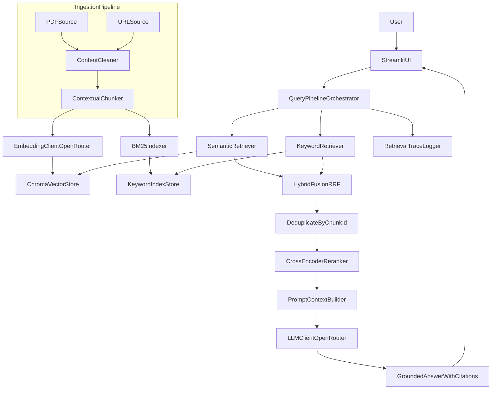

# Hybrid-Search RAG Chatbot Implementation Plan

## Scope from Requirements
Build an end-to-end teaching-assistant chatbot that ingests PDF/URL content, preserves context during chunking, combines semantic + keyword retrieval, reranks results, and serves answers via Streamlit.

Reference requirements document: [d:\KICKDRUM\chatbot\AI Associate - RAG Systems & Advanced Retrieval Hands-on.md](d:\KICKDRUM\chatbot\AI Associate - RAG Systems & Advanced Retrieval Hands-on.md)

## Chosen Architecture and Why
- **Python-first RAG stack** because it has the most mature ecosystem for ingestion, retrieval, reranking, and rapid experimentation.
- **OpenRouter (OpenAI-compatible) for LLM + embeddings** to keep model/provider flexibility while using stable OpenAI-style SDKs.
- **Hybrid retrieval (vector + BM25 keyword)** because semantic search alone misses exact terms, while keyword alone misses conceptual meaning.
- **Reranking layer** to improve precision before prompt construction, reducing hallucinations and token waste.
- **Streamlit UI** for fast, demonstrable end-user workflow and easier deliverable/demo alignment.

## Proposed Tech Stack (List)
- **Language/runtime**: Python 3.11+
- **API/UI**: Streamlit
- **Parsing/Ingestion**: `pypdf`, `trafilatura` (or `newspaper3k`) for URL content extraction
- **Chunking**: custom contextual chunker + recursive splitter (`langchain-text-splitters` optional)
- **Embeddings**: OpenRouter embedding model (OpenAI-compatible endpoint)
- **Vector store**: Chroma (local persistent)
- **Keyword search**: BM25 (`rank-bm25`) over chunk corpus
- **Hybrid fusion**: Reciprocal Rank Fusion (RRF) + dedup by chunk/document id
- **Reranker**: cross-encoder reranker (e.g., `bge-reranker-base`) or API reranker if preferred
- **LLM generation**: OpenRouter chat completion model (OpenAI-compatible)
- **Config/secrets**: `.env` + `pydantic-settings`
- **Observability/eval**: structured logs + retrieval trace output + small golden-question eval script
- **Testing**: `pytest` for unit/integration checks

## Proposed Folder Structure
- **Root app files**
  - `app.py` (Streamlit entrypoint)
  - `requirements.txt` or `pyproject.toml`
  - `.env.example`
- **Source package (`src/`)**
  - `src/config/settings.py` (env/config)
  - `src/ingestion/loader.py` (PDF/URL load)
  - `src/ingestion/cleaner.py` (normalization)
  - `src/chunking/contextual_chunker.py` (context-preserving chunk logic)
  - `src/embeddings/embedder.py` (OpenRouter embeddings client)
  - `src/retrieval/vector_store.py` (Chroma ops)
  - `src/retrieval/keyword_index.py` (BM25 build/query)
  - `src/retrieval/hybrid.py` (fusion + dedup)
  - `src/retrieval/reranker.py` (top-K reranking)
  - `src/generation/prompt_builder.py` (context packing/citations)
  - `src/generation/llm_client.py` (OpenRouter chat client)
  - `src/pipeline/query_pipeline.py` (end-to-end orchestration)
  - `src/utils/logging.py`, `src/utils/ids.py`
- **Data and runtime artifacts**
  - `data/raw/`, `data/processed/`, `data/chunks/`
  - `storage/chroma/` (persistent vector DB)
  - `storage/bm25/` (serialized keyword index)
- **Quality/evaluation**
  - `tests/unit/`, `tests/integration/`
  - `eval/golden_questions.json`
  - `scripts/run_eval.py`, `scripts/reindex.py`

## Detailed Architecture Diagram

## Component-by-Component Rationale
- **Ingestion + cleaning**: standardizes noisy PDF/HTML into consistent text for robust downstream chunking.
- **Contextual chunker**: keeps neighboring context/metadata to avoid meaning loss from naive fixed-size splits.
- **Dual indexes (vector + BM25)**: guarantees both semantic understanding and exact keyword recall.
- **Hybrid fusion (RRF)**: combines ranking signals without fragile score normalization.
- **Reranker**: adds high-precision relevance scoring before passing context to LLM.
- **Prompt context builder**: controls token budget and evidence ordering; improves faithfulness.
- **LLM client**: produces final response constrained to retrieved evidence.
- **Trace logger**: debuggability for each stage (retrieved chunks, rerank scores, final context set).

## Phased Plan

### Phase 0: Project Setup and Baseline Scaffolding
- **Tasks**
  - Initialize Python project and dependencies.
  - Create folder structure and module skeletons.
  - Configure environment variables and secrets handling.
- **Tech stack used**
  - Python, Streamlit, dotenv/pydantic-settings, pytest.
- **Best practices**
  - Keep provider/model IDs configurable via env.
  - Separate config, pipeline logic, and UI concerns.
  - Add deterministic IDs for docs/chunks from day 1.
- **Definition of done**
  - App starts; modules import cleanly; config validation passes.
- **Edge cases**
  - Missing API key; invalid env values; missing directories.
- **Phase summary**
  - Establishes stable foundations for rapid feature layering.

### Phase 1: Document Ingestion and Contextual Chunking
- **Tasks**
  - Ingest from PDF path and URL.
  - Clean text and extract metadata (source, title, section, page).
  - Implement contextual chunking strategy (window overlap + section awareness).
- **Tech stack used**
  - `pypdf`, `trafilatura`/`newspaper3k`, custom chunking utilities.
- **Best practices**
  - Preserve provenance metadata for each chunk.
  - Use chunk size/overlap tuned for embedding model context.
  - Reject/flag low-quality extracted text early.
- **Definition of done**
  - Input docs become validated chunk objects with metadata and stable IDs.
- **Edge cases**
  - Scanned PDFs (no text layer), malformed HTML, duplicated boilerplate content.
- **Phase summary**
  - Converts raw sources into context-rich chunks ready for indexing.

### Phase 2: Vector Embeddings and Local Storage
- **Tasks**
  - Generate embeddings for chunks via OpenRouter endpoint.
  - Persist vectors and metadata into Chroma.
  - Add index/reindex workflow.
- **Tech stack used**
  - OpenAI-compatible client (OpenRouter), Chroma.
- **Best practices**
  - Batch embedding calls; retry with exponential backoff.
  - Make indexing idempotent using chunk IDs.
  - Persist model/version metadata for reproducibility.
- **Definition of done**
  - Semantic similarity query returns relevant chunks with metadata.
- **Edge cases**
  - API rate limits, transient failures, partial indexing interruptions.
- **Phase summary**
  - Enables semantic retrieval over persistent local vector storage.

### Phase 3: Hybrid Search (Semantic + Keyword)
- **Tasks**
  - Build BM25 index from same chunk corpus.
  - Run semantic and keyword retrieval in parallel.
  - Fuse rankings and deduplicate candidates.
- **Tech stack used**
  - `rank-bm25`, Chroma retriever, RRF fusion.
- **Best practices**
  - Keep retrieval top-N configurable per channel.
  - Normalize text consistently for keyword indexing.
  - Log retrieval overlap metrics to tune fusion.
- **Definition of done**
  - Hybrid results outperform single-method retrieval on sample queries.
- **Edge cases**
  - Keyword-only jargon queries, semantic paraphrase queries, duplicate chunk matches.
- **Phase summary**
  - Improves recall by combining complementary retrieval modes.

### Phase 4: Reranking and Context Selection
- **Tasks**
  - Score fused candidates with reranker.
  - Select top-K evidence chunks with token-budget control.
  - Produce transparent retrieval trace.
- **Tech stack used**
  - Cross-encoder reranker model/API, token counting utility.
- **Best practices**
  - Keep rerank K and final context K separate.
  - Enforce max-token guardrails before LLM call.
  - Prefer diversity-aware selection when top chunks are redundant.
- **Definition of done**
  - Final context set is high relevance, non-duplicative, and token-safe.
- **Edge cases**
  - Highly similar chunks crowding context; long chunks exceeding budget.
- **Phase summary**
  - Sharpens precision and prepares optimal evidence for generation.

### Phase 5: LLM Answer Generation and Streamlit UI
- **Tasks**
  - Build grounded prompt template and answer generator.
  - Add Streamlit chat UI for ingestion + Q&A.
  - Display answer, sources, and retrieval debug details.
- **Tech stack used**
  - Streamlit, OpenRouter chat model, prompt templates.
- **Best practices**
  - Strict system prompt to avoid unsupported claims.
  - Include source citations in output.
  - Add fallback responses when confidence/context is weak.
- **Definition of done**
  - User can ingest docs and ask questions end-to-end via UI.
- **Edge cases**
  - No relevant results, ambiguous user questions, prompt injection in documents.
- **Phase summary**
  - Delivers the complete interactive chatbot experience.

### Phase 6: Validation, Hardening, and Demo Readiness
- **Tasks**
  - Create golden question set and evaluate retrieval/answer quality.
  - Add integration tests and failure-path checks.
  - Prepare demo script showing full pipeline.
- **Tech stack used**
  - `pytest`, small eval harness, structured logs.
- **Best practices**
  - Track retrieval hit@K and groundedness checks.
  - Add regression tests for ingestion/chunking behavior.
  - Document known limitations and tuning knobs.
- **Definition of done**
  - Deliverable-quality demo with measurable retrieval and answer quality.
- **Edge cases**
  - Model/provider outages, inconsistent outputs across reruns.
- **Phase summary**
  - Ensures reliability, quality, and clear deliverable completion.

## Deliverables Mapping
- **Working implementation**: completed by Phases 0-5.
- **Document processing + Q&A ability**: Phases 1-5.
- **Full pipeline demonstration**: Phase 6 with eval + demo flow.

## Suggested Execution Order and Milestones
- Milestone A: Setup + ingestion/chunking complete.
- Milestone B: Vector + keyword retrieval and hybrid fusion complete.
- Milestone C: Reranking + answer generation integrated.
- Milestone D: UI polished, tests/eval completed, demo-ready handoff.
